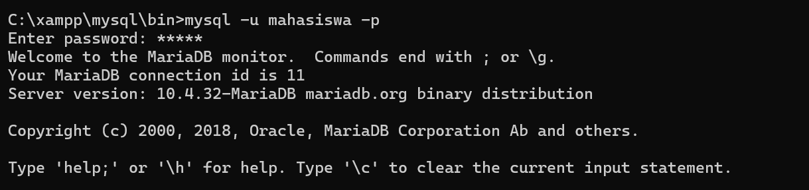
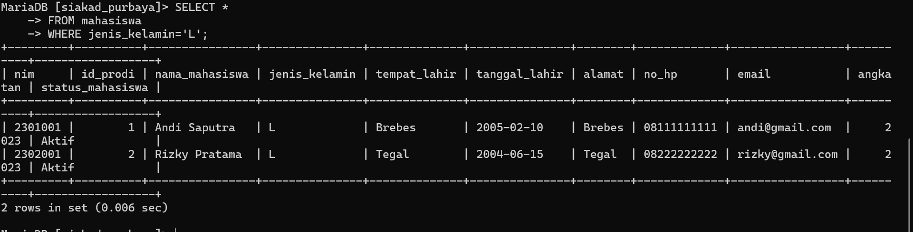
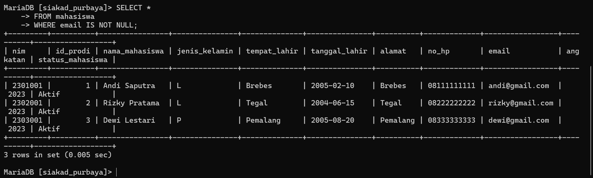
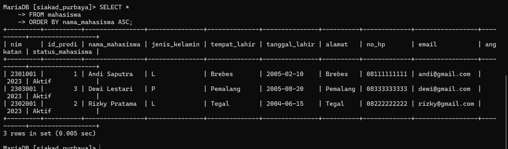

# 💻 Praktikum SQL SELECT

## 👨‍🎓 Identitas
| Keterangan | Isi |
|---|---|
| Nama | Nama Kamu |
| NIM | NIM Kamu |
| Kelas | Kelas Kamu |

---

# 📚 Materi Praktikum

- SELECT *
- SELECT kolom tertentu
- WHERE
- WHERE NULL dan NOT NULL
- ORDER BY
- AS (Alias)

---

# 1️⃣ SELECT Untuk Melihat Semua Kolom Dari Suatu Tabel

## ✨ Syntax

```sql
SELECT * FROM mahasiswa;
```

## 📸 Hasil



---

# 2️⃣ SELECT Untuk Melihat Kolom Tertentu

## ✨ Syntax

```sql
SELECT nama_mahasiswa, email
FROM mahasiswa;
```

## 📸 Hasil

 tertentu.PNG)

---

# 3️⃣ WHERE Digunakan Untuk Membatasi Hasil SELECT

## ✨ Syntax

```sql
SELECT *
FROM mahasiswa
WHERE jenis_kelamin='L';
```

## 📸 Hasil



---

# 4️⃣ WHERE NULL dan NOT NULL

## ✨ Syntax

```sql
SELECT *
FROM mahasiswa
WHERE email IS NOT NULL;
```

## 📸 Hasil



---

# 5️⃣ ORDER BY Digunakan Untuk Mengurutkan Hasil SELECT

## ✨ Syntax

```sql
SELECT *
FROM mahasiswa
ORDER BY nama_mahasiswa ASC;
```

## 📸 Hasil



---

# 6️⃣ AS Digunakan Untuk Mengganti Nama Kolom Pada Tampilan

## ✨ Syntax

```sql
SELECT nama_mahasiswa AS Nama,
email AS Email_Mahasiswa
FROM mahasiswa;
```

## 📸 Hasil


---

# ✅ Kesimpulan

Pada praktikum ini telah dipelajari:
- SELECT
- WHERE
- ORDER BY
- AS
