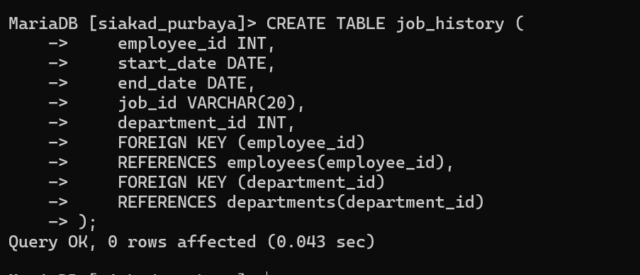

# 💻 Praktikum P6 Primary Key dan Foreign Key

## 👨‍🎓 Identitas

| Keterangan | Isi |
|---|---|
| Nama | Dwi Sekar Arum |
| NIM | 2502001|
| Kelas | TI 2 A |

---

# 📚 Tujuan Praktikum

Praktikum ini bertujuan untuk memahami:
- Primary Key
- Foreign Key
- Relasi antar tabel pada MySQL

---

# 1️⃣ Membuat Tabel Departments

## ✨ Syntax SQL

```sql
CREATE TABLE departments (
    department_id INT PRIMARY KEY,
    department_name VARCHAR(50),
    manager_id INT,
    location_id INT
);
```

## 📸 Hasil


---

# 2️⃣ Describe Tabel Departments

## ✨ Syntax SQL

```sql
DESCRIBE departments;
```

## 📸 Hasil


---

# 3️⃣ Insert Data Departments

## ✨ Syntax SQL

```sql
INSERT INTO departments VALUES
(10,'Administration',200,1700),
(20,'Marketing',201,1800),
(50,'Shipping',124,1500),
(60,'IT',103,1400),
(90,'Executive',100,1700),
(110,'Accounting',205,1700);
```

## 📸 Hasil


---

# 4️⃣ Select Data Departments

## ✨ Syntax SQL

```sql
SELECT * FROM departments;
```

## 📸 Hasil


---

# 5️⃣ Membuat Tabel Employees

## ✨ Syntax SQL

```sql
CREATE TABLE employees (
    employee_id INT PRIMARY KEY,
    first_name VARCHAR(50),
    last_name VARCHAR(50),
    department_id INT,
    FOREIGN KEY (department_id)
    REFERENCES departments(department_id)
);
```

## 📸 Hasil


---

# 6️⃣ Describe Tabel Employees

## ✨ Syntax SQL

```sql
DESCRIBE employees;
```

## 📸 Hasil


---

# 7️⃣ Insert Data Employees

## ✨ Syntax SQL

```sql
INSERT INTO employees VALUES
(174,'Ellen','Abel',20),
(142,'Curtis','Davies',50),
(102,'Lex','De Haan',90),
(104,'Bruce','Ernst',60),
(202,'Pat','Fay',20),
(206,'William','Gietz',110);
```

## 📸 Hasil


---

# 8️⃣ Select Data Employees

## ✨ Syntax SQL

```sql
SELECT * FROM employees;
```

## 📸 Hasil


---

# 9️⃣ Membuat Tabel Job History

## ✨ Syntax SQL

```sql
CREATE TABLE job_history (
    employee_id INT,
    start_date DATE,
    end_date DATE,
    job_id VARCHAR(20),
    department_id INT,
    FOREIGN KEY (employee_id)
    REFERENCES employees(employee_id),
    FOREIGN KEY (department_id)
    REFERENCES departments(department_id)
);
```

## 📸 Hasil



---

# 🔟 Describe Tabel Job History

## ✨ Syntax SQL

```sql
DESCRIBE job_history;
```

## 📸 Hasil


---

# 1️⃣1️⃣ Insert Data Job History

## ✨ Syntax SQL

```sql
INSERT INTO job_history VALUES
(102,'2001-01-13','2006-07-24','IT_PROG',60),
(142,'1997-09-21','2001-10-27','AC_ACCOUNT',50),
(202,'2002-01-13','2006-12-31','MK_REP',20);
```

## 📸 Hasil


---

# 1️⃣2️⃣ Select Data Job History

## ✨ Syntax SQL

```sql
SELECT * FROM job_history;
```

## 📸 Hasil


---

# 📖 Penjelasan Primary Key dan Foreign Key

## 🔑 Primary Key

Primary Key adalah kolom yang digunakan sebagai identitas unik pada setiap data dalam tabel.

Contoh:
- `department_id`
- `employee_id`

Fungsi Primary Key:
- membedakan setiap data
- tidak boleh sama
- tidak boleh NULL

---

## 🔗 Foreign Key

Foreign Key adalah kolom yang digunakan untuk menghubungkan tabel satu dengan tabel lainnya.

Contoh:
- `department_id` pada tabel employees
- `employee_id` pada tabel job_history

Fungsi Foreign Key:
- menjaga relasi antar tabel
- menjaga konsistensi data

---

# ✅ Kesimpulan

Pada praktikum ini telah dipelajari:
- pembuatan tabel
- penggunaan Primary Key
- penggunaan Foreign Key
- relasi antar tabel pada MySQL
